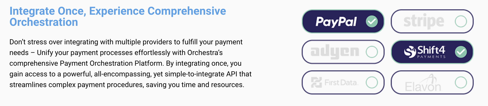

<div align="center">

[](https://bluetime.io&#x2F;)

# [Bluetime](https://bluetime.io&#x2F;)<a id="bluetime"></a>

Code Version 1.0.7.15

</div>

## Table of Contents<a id="table-of-contents"></a>

<!-- toc -->

- [Installation](#installation)
- [Getting Started](#getting-started)
- [Reference](#reference)
  * [`bluetime.cardOperations.getBrandPrefix`](#bluetimecardoperationsgetbrandprefix)
  * [`bluetime.cardOperations.getTokenStartOperation`](#bluetimecardoperationsgettokenstartoperation)
  * [`bluetime.cardOperations.getTopBrandsLookup`](#bluetimecardoperationsgettopbrandslookup)
  * [`bluetime.cardOperations.performUniversalPaymentGatewayCharge`](#bluetimecardoperationsperformuniversalpaymentgatewaycharge)
  * [`bluetime.cardOperations.performValidation`](#bluetimecardoperationsperformvalidation)
  * [`bluetime.cardOperations.performValidation_0`](#bluetimecardoperationsperformvalidation_0)
  * [`bluetime.cardOperations.tokenizeAndStore`](#bluetimecardoperationstokenizeandstore)
  * [`bluetime.customForms.getList`](#bluetimecustomformsgetlist)
  * [`bluetime.customForms.removeForm`](#bluetimecustomformsremoveform)
  * [`bluetime.customForms.uploadFormFolder`](#bluetimecustomformsuploadformfolder)
  * [`bluetime.cvvOperations.getTokenCvvOperation`](#bluetimecvvoperationsgettokencvvoperation)
  * [`bluetime.cvvOperations.performUniversalPaymentGatewayCharge`](#bluetimecvvoperationsperformuniversalpaymentgatewaycharge)
  * [`bluetime.cvvOperations.validateOperation`](#bluetimecvvoperationsvalidateoperation)
  * [`bluetime.networkToken.cardTokenize`](#bluetimenetworktokencardtokenize)
  * [`bluetime.networkToken.delete`](#bluetimenetworktokendelete)
  * [`bluetime.paymentGateway.listGateways`](#bluetimepaymentgatewaylistgateways)
  * [`bluetime.paymentGateway.performAuthorizeOperation`](#bluetimepaymentgatewayperformauthorizeoperation)
  * [`bluetime.paymentGateway.performCaptureOperation`](#bluetimepaymentgatewayperformcaptureoperation)
  * [`bluetime.paymentGateway.performChargeOperation`](#bluetimepaymentgatewayperformchargeoperation)
  * [`bluetime.paymentGateway.performRefundOperation`](#bluetimepaymentgatewayperformrefundoperation)
  * [`bluetime.paymentGateway.voidOperation`](#bluetimepaymentgatewayvoidoperation)
  * [`bluetime.paymentGatewayAccounts.addOrReplace`](#bluetimepaymentgatewayaccountsaddorreplace)
  * [`bluetime.paymentGatewayAccounts.getAll`](#bluetimepaymentgatewayaccountsgetall)
  * [`bluetime.paymentGatewayAccounts.getInfo`](#bluetimepaymentgatewayaccountsgetinfo)
  * [`bluetime.paymentGatewayAccounts.removeAccount`](#bluetimepaymentgatewayaccountsremoveaccount)
  * [`bluetime.stringTokens.deleteByToken`](#bluetimestringtokensdeletebytoken)
  * [`bluetime.stringTokens.getContent`](#bluetimestringtokensgetcontent)
  * [`bluetime.stringTokens.getMetaData`](#bluetimestringtokensgetmetadata)
  * [`bluetime.stringTokens.storeAndTokenize`](#bluetimestringtokensstoreandtokenize)
  * [`bluetime.threeDsMerchants.getMerchantInfo`](#bluetimethreedsmerchantsgetmerchantinfo)
  * [`bluetime.threeDsMerchants.listMerchants`](#bluetimethreedsmerchantslistmerchants)
  * [`bluetime.threeDsMerchants.removeMerchant`](#bluetimethreedsmerchantsremovemerchant)
  * [`bluetime.threeDsMerchants.updateMerchantInfo`](#bluetimethreedsmerchantsupdatemerchantinfo)
  * [`bluetime.threeDsSessions.getChallengeStatus`](#bluetimethreedssessionsgetchallengestatus)
  * [`bluetime.threeDsSessions.getTokenStartOperation`](#bluetimethreedssessionsgettokenstartoperation)
  * [`bluetime.threeDsSessions.handleFingerprintCallback`](#bluetimethreedssessionshandlefingerprintcallback)
  * [`bluetime.threeDsSessions.handleMpiChallengeCallback`](#bluetimethreedssessionshandlempichallengecallback)
  * [`bluetime.threeDsSessions.performValidationOperation`](#bluetimethreedssessionsperformvalidationoperation)
  * [`bluetime.tools.getBrandLookup`](#bluetimetoolsgetbrandlookup)
  * [`bluetime.tools.lookupMetadata`](#bluetimetoolslookupmetadata)
  * [`bluetime.tools.validateCardDetails`](#bluetimetoolsvalidatecarddetails)
  * [`bluetime.tools.validateLuhnCard`](#bluetimetoolsvalidateluhncard)
  * [`bluetime.utils.validateApiKey`](#bluetimeutilsvalidateapikey)

<!-- tocstop -->

## Installation<a id="installation"></a>
<div align="center">
  <a href="https://konfigthis.com/sdk-sign-up?company=BlueTime&language=TypeScript">
    
  </a>
</div>

## Getting Started<a id="getting-started"></a>

```typescript
import { BlueTime } from "blue-time-typescript-sdk";

const bluetime = new BlueTime({
  // Defining the base path is optional and defaults to https://api.epaytools.com
  // basePath: "https://api.epaytools.com",
  apiKey: "API_KEY",
  accessToken: "ACCESS_TOKEN",
});

const getBrandPrefixResponse = await bluetime.cardOperations.getBrandPrefix({
  iin: "48072888",
});

console.log(getBrandPrefixResponse);
```

## Reference<a id="reference"></a>


### `bluetime.cardOperations.getBrandPrefix`<a id="bluetimecardoperationsgetbrandprefix"></a>

Return brand of card prefix.

#### 🛠️ Usage<a id="🛠️-usage"></a>

```typescript
const getBrandPrefixResponse = await bluetime.cardOperations.getBrandPrefix({
  iin: "48072888",
});
```

#### ⚙️ Parameters<a id="⚙️-parameters"></a>

##### iin: `string`<a id="iin-string"></a>

Card prefix

#### 🔄 Return<a id="🔄-return"></a>

[PayToolsApiModelsBrandLookupResult](./models/pay-tools-api-models-brand-lookup-result.ts)

#### 🌐 Endpoint<a id="🌐-endpoint"></a>

`/CardOperations/brand` `GET`

[🔙 **Back to Table of Contents**](#table-of-contents)

---


### `bluetime.cardOperations.getTokenStartOperation`<a id="bluetimecardoperationsgettokenstartoperation"></a>

Get a token to start a card operation

#### 🛠️ Usage<a id="🛠️-usage"></a>

```typescript
const getTokenStartOperationResponse =
  await bluetime.cardOperations.getTokenStartOperation({
    ttl: 60,
    vld: "VeryHigh",
    _3ds: "Mandatory",
    tkn: "Always",
  });
```

#### ⚙️ Parameters<a id="⚙️-parameters"></a>

##### ttl: `number`<a id="ttl-number"></a>

Time to live for the returned token

##### threeDsSessionModel: [`PayToolsBlAuthenticationThreeDsSessionModel`](./models/pay-tools-bl-authentication-three-ds-session-model.ts)<a id="threedssessionmodel-paytoolsblauthenticationthreedssessionmodelmodelspay-tools-bl-authentication-three-ds-session-modelts"></a>

##### vld: [`PciBookingIINLookupLibraryRiskLevel`](./models/pci-booking-iinlookup-library-risk-level.ts)<a id="vld-pcibookingiinlookuplibraryrisklevelmodelspci-booking-iinlookup-library-risk-levelts"></a>

##### 3ds: [`PayToolsSharedEnumsPerform3ds`](./models/pay-tools-shared-enums-perform3ds.ts)<a id="3ds-paytoolssharedenumsperform3dsmodelspay-tools-shared-enums-perform3dsts"></a>

Options for performing #DS

##### crg: `boolean`<a id="crg-boolean"></a>

Is Card charge required for this session

##### tkn: [`PayToolsBlAuthenticationTokenizationAction`](./models/pay-tools-bl-authentication-tokenization-action.ts)<a id="tkn-paytoolsblauthenticationtokenizationactionmodelspay-tools-bl-authentication-tokenization-actionts"></a>

Tokenization Action

##### crg_d: [`PayToolsBlAuthenticationChargePresetData`](./models/pay-tools-bl-authentication-charge-preset-data.ts)<a id="crg_d-paytoolsblauthenticationchargepresetdatamodelspay-tools-bl-authentication-charge-preset-datats"></a>

#### 🔄 Return<a id="🔄-return"></a>

[PayToolsApiModelsJwsMultipleOutputModel](./models/pay-tools-api-models-jws-multiple-output-model.ts)

#### 🌐 Endpoint<a id="🌐-endpoint"></a>

`/CardOperations` `POST`

[🔙 **Back to Table of Contents**](#table-of-contents)

---


### `bluetime.cardOperations.getTopBrandsLookup`<a id="bluetimecardoperationsgettopbrandslookup"></a>

The result is an array of 5 elements, where each element represents iin prefixes for a givel size as well as the list of logo Url's for all brands.
Each element in the top-level array is an object where members are prefixes and data is the brand.
For a quick lookup:
1. get the element by the size of your prefix.
2. try to obtain the prefix as a member name; The member value is the brand

For logo lookup finf thr brand name as the key to the logos member.
If not found, you can try using 'DEFAULT'.

#### 🛠️ Usage<a id="🛠️-usage"></a>

```typescript
const getTopBrandsLookupResponse =
  await bluetime.cardOperations.getTopBrandsLookup();
```

#### 🔄 Return<a id="🔄-return"></a>

[PayToolsApiModelsTopBrands](./models/pay-tools-api-models-top-brands.ts)

#### 🌐 Endpoint<a id="🌐-endpoint"></a>

`/CardOperations/topBrands` `GET`

[🔙 **Back to Table of Contents**](#table-of-contents)

---


### `bluetime.cardOperations.performUniversalPaymentGatewayCharge`<a id="bluetimecardoperationsperformuniversalpaymentgatewaycharge"></a>

Perform Univesal payment gateway charge operation

#### 🛠️ Usage<a id="🛠️-usage"></a>

```typescript
const performUniversalPaymentGatewayChargeResponse =
  await bluetime.cardOperations.performUniversalPaymentGatewayCharge({
    card: {
      cardType: "Visa",
      cardHolderName: "cardHolderName_example",
      cardNumber: "@Cu2LC4aWwWL9Y864DZtaGRyyGFZKkkp4",
      expirationYear: 1,
      expirationMonth: 1,
    },
  });
```

#### ⚙️ Parameters<a id="⚙️-parameters"></a>

##### card: [`PayToolsApiModelsCardInputModel`](./models/pay-tools-api-models-card-input-model.ts)<a id="card-paytoolsapimodelscardinputmodelmodelspay-tools-api-models-card-input-modelts"></a>

##### payerDetails: [`PayToolsApiModelsPayerDetailsNoIpAddress`](./models/pay-tools-api-models-payer-details-no-ip-address.ts)<a id="payerdetails-paytoolsapimodelspayerdetailsnoipaddressmodelspay-tools-api-models-payer-details-no-ip-addressts"></a>

##### myRef: `string`<a id="myref-string"></a>

Your custom reference for this transaction

#### 🔄 Return<a id="🔄-return"></a>

[PayToolsApiModelsJwsOutputModel1PaymentsOperationResultPaymentsVersion0000CultureneutralPublicKeyTokennull](./models/pay-tools-api-models-jws-output-model1-payments-operation-result-payments-version0000-cultureneutral-public-key-tokennull.ts)

#### 🌐 Endpoint<a id="🌐-endpoint"></a>

`/CardOperations/charge` `POST`

[🔙 **Back to Table of Contents**](#table-of-contents)

---


### `bluetime.cardOperations.performValidation`<a id="bluetimecardoperationsperformvalidation"></a>

Perform card validation

#### 🛠️ Usage<a id="🛠️-usage"></a>

```typescript
const performValidationResponse =
  await bluetime.cardOperations.performValidation({
    iin: "48072888",
    countryCode: "AE",
  });
```

#### ⚙️ Parameters<a id="⚙️-parameters"></a>

##### countryCode: `string`<a id="countrycode-string"></a>

2 letter country code (<a href=\\\"https://en.wikipedia.org/wiki/ISO_3166-2#Current_codes\\\" target=\\\"_blank\\\">ISO 3166-2 </a>)

##### iin: `string`<a id="iin-string"></a>

Card prefix

##### city: `string`<a id="city-string"></a>

City

##### stateProvince: `string`<a id="stateprovince-string"></a>

State or Province

#### 🔄 Return<a id="🔄-return"></a>

[PayToolsApiModelsJwsOutputModel1pciBookingIINLookupLibraryCardValidationResultpciBookingIINLookupLibraryVersion1040CultureneutralPublicKeyTokennull](./models/pay-tools-api-models-jws-output-model1pci-booking-iinlookup-library-card-validation-resultpci-booking-iinlookup-library-version1040-cultureneutral-public-key-tokennull.ts)

#### 🌐 Endpoint<a id="🌐-endpoint"></a>

`/CardOperations/validate` `POST`

[🔙 **Back to Table of Contents**](#table-of-contents)

---


### `bluetime.cardOperations.performValidation_0`<a id="bluetimecardoperationsperformvalidation_0"></a>

Perform validation of the operation using to signed data

#### 🛠️ Usage<a id="🛠️-usage"></a>

```typescript
const performValidation_0Response =
  await bluetime.cardOperations.performValidation_0();
```

#### 🔄 Return<a id="🔄-return"></a>

[PayToolsBlAuthenticationSignedData](./models/pay-tools-bl-authentication-signed-data.ts)

#### 🌐 Endpoint<a id="🌐-endpoint"></a>

`/CardOperations/opValidate` `GET`

[🔙 **Back to Table of Contents**](#table-of-contents)

---


### `bluetime.cardOperations.tokenizeAndStore`<a id="bluetimecardoperationstokenizeandstore"></a>

Tokenize and store card number

#### 🛠️ Usage<a id="🛠️-usage"></a>

```typescript
const tokenizeAndStoreResponse = await bluetime.cardOperations.tokenizeAndStore(
  {
    payload: "payload_example",
  }
);
```

#### ⚙️ Parameters<a id="⚙️-parameters"></a>

##### payload: `string`<a id="payload-string"></a>

The content of the string you would like to tokenize

#### 🔄 Return<a id="🔄-return"></a>

[PayToolsApiModelsJwsOutputModel1PayToolsApiModelsStringTokenMetaDataOutputModelPayToolsApiVersion10715CultureneutralPublicKeyTokennull](./models/pay-tools-api-models-jws-output-model1-pay-tools-api-models-string-token-meta-data-output-model-pay-tools-api-version10715-cultureneutral-public-key-tokennull.ts)

#### 🌐 Endpoint<a id="🌐-endpoint"></a>

`/CardOperations/store` `POST`

[🔙 **Back to Table of Contents**](#table-of-contents)

---


### `bluetime.customForms.getList`<a id="bluetimecustomformsgetlist"></a>

This method allows you to retrieve the list of custom forms stored in PCI Booking

#### 🛠️ Usage<a id="🛠️-usage"></a>

```typescript
const getListResponse = await bluetime.customForms.getList();
```

#### 🔄 Return<a id="🔄-return"></a>

[PayToolsApiModelsCustomFormMetaModel](./models/pay-tools-api-models-custom-form-meta-model.ts)

#### 🌐 Endpoint<a id="🌐-endpoint"></a>

`/CustomForms` `GET`

[🔙 **Back to Table of Contents**](#table-of-contents)

---


### `bluetime.customForms.removeForm`<a id="bluetimecustomformsremoveform"></a>

This method allows you to delete a custom form that was previously stored in PCI Booking.

#### 🛠️ Usage<a id="🛠️-usage"></a>

```typescript
const removeFormResponse = await bluetime.customForms.removeForm({
  name: "name_example",
});
```

#### ⚙️ Parameters<a id="⚙️-parameters"></a>

##### name: `string`<a id="name-string"></a>

The unique identifier provided to this custom form when originally uploaded

#### 🌐 Endpoint<a id="🌐-endpoint"></a>

`/CustomForms/{name}` `DELETE`

[🔙 **Back to Table of Contents**](#table-of-contents)

---


### `bluetime.customForms.uploadFormFolder`<a id="bluetimecustomformsuploadformfolder"></a>

This method allows you to upload a custom form into PCI Booking. You can design your custom form copletely on your own and upload any and all related content (JavaScript, stylesheet, images, etc) to PCI Booking. All content should be stored in one ZIP file that you will provide in this request.
The uploaded data should be a zip file, properly encoded as a part named 'zipFile' in the body.

#### 🛠️ Usage<a id="🛠️-usage"></a>

```typescript
const uploadFormFolderResponse = await bluetime.customForms.uploadFormFolder({
  name: "name_example",
});
```

#### ⚙️ Parameters<a id="⚙️-parameters"></a>

##### name: `string`<a id="name-string"></a>

The unique name to identify this form in PCI Booking. You will use this value whenever referencing this custom form.

##### ContentType: `string`<a id="contenttype-string"></a>

##### ContentDisposition: `string`<a id="contentdisposition-string"></a>

##### Headers: Record<string, `Array<string>`<a id="headers-record"></a>
                              `string`[]>

##### Length: `number`<a id="length-number"></a>

##### Name: `string`<a id="name-string"></a>

##### FileName: `string`<a id="filename-string"></a>

#### 🔄 Return<a id="🔄-return"></a>

[PayToolsApiModelsCustomFormUploadModel](./models/pay-tools-api-models-custom-form-upload-model.ts)

#### 🌐 Endpoint<a id="🌐-endpoint"></a>

`/CustomForms/{name}` `PUT`

[🔙 **Back to Table of Contents**](#table-of-contents)

---


### `bluetime.cvvOperations.getTokenCvvOperation`<a id="bluetimecvvoperationsgettokencvvoperation"></a>

Get a token to start a CVV operation

#### 🛠️ Usage<a id="🛠️-usage"></a>

```typescript
const getTokenCvvOperationResponse =
  await bluetime.cvvOperations.getTokenCvvOperation({
    ttl: 60,
  });
```

#### ⚙️ Parameters<a id="⚙️-parameters"></a>

##### ttl: `number`<a id="ttl-number"></a>

Time to live for the returned token

##### card: [`PayToolsSharedModelsCardStoredCard`](./models/pay-tools-shared-models-card-stored-card.ts)<a id="card-paytoolssharedmodelscardstoredcardmodelspay-tools-shared-models-card-stored-cardts"></a>

##### crg_d: [`PayToolsBlAuthenticationChargePresetData`](./models/pay-tools-bl-authentication-charge-preset-data.ts)<a id="crg_d-paytoolsblauthenticationchargepresetdatamodelspay-tools-bl-authentication-charge-preset-datats"></a>

#### 🔄 Return<a id="🔄-return"></a>

[PayToolsApiModelsJwsOutputModel](./models/pay-tools-api-models-jws-output-model.ts)

#### 🌐 Endpoint<a id="🌐-endpoint"></a>

`/CvvOperations` `POST`

[🔙 **Back to Table of Contents**](#table-of-contents)

---


### `bluetime.cvvOperations.performUniversalPaymentGatewayCharge`<a id="bluetimecvvoperationsperformuniversalpaymentgatewaycharge"></a>

Perform Univesal payment gateway charge operation

#### 🛠️ Usage<a id="🛠️-usage"></a>

```typescript
const performUniversalPaymentGatewayChargeResponse =
  await bluetime.cvvOperations.performUniversalPaymentGatewayCharge({
    cvv: "4807",
  });
```

#### ⚙️ Parameters<a id="⚙️-parameters"></a>

##### cvv: `string`<a id="cvv-string"></a>

The card details that should be charged. You can either provide us with the raw card details or provide a reference to the stored card details in a token.

#### 🔄 Return<a id="🔄-return"></a>

[PayToolsApiModelsJwsOutputModel1PayToolsBlAuthenticationChargeCardSignedModelPayToolsBlVersion1000CultureneutralPublicKeyTokennull](./models/pay-tools-api-models-jws-output-model1-pay-tools-bl-authentication-charge-card-signed-model-pay-tools-bl-version1000-cultureneutral-public-key-tokennull.ts)

#### 🌐 Endpoint<a id="🌐-endpoint"></a>

`/CvvOperations/charge` `POST`

[🔙 **Back to Table of Contents**](#table-of-contents)

---


### `bluetime.cvvOperations.validateOperation`<a id="bluetimecvvoperationsvalidateoperation"></a>

Perform validation of the operation using signed data from charge operation

#### 🛠️ Usage<a id="🛠️-usage"></a>

```typescript
const validateOperationResponse =
  await bluetime.cvvOperations.validateOperation();
```

#### 🔄 Return<a id="🔄-return"></a>

[PayToolsBlAuthenticationCvvSignedDataModel](./models/pay-tools-bl-authentication-cvv-signed-data-model.ts)

#### 🌐 Endpoint<a id="🌐-endpoint"></a>

`/CvvOperations/opValidate` `GET`

[🔙 **Back to Table of Contents**](#table-of-contents)

---


### `bluetime.networkToken.cardTokenize`<a id="bluetimenetworktokencardtokenize"></a>

Network-tokenize a card

#### 🛠️ Usage<a id="🛠️-usage"></a>

```typescript
const cardTokenizeResponse = await bluetime.networkToken.cardTokenize({});
```

#### ⚙️ Parameters<a id="⚙️-parameters"></a>

##### tokenizationRequest: [`PayToolsApiModelsTokenizationRequest`](./models/pay-tools-api-models-tokenization-request.ts)<a id="tokenizationrequest-paytoolsapimodelstokenizationrequestmodelspay-tools-api-models-tokenization-requestts"></a>

##### card: [`PayToolsApiModelsCardBaseWithSecurityCode`](./models/pay-tools-api-models-card-base-with-security-code.ts)<a id="card-paytoolsapimodelscardbasewithsecuritycodemodelspay-tools-api-models-card-base-with-security-codets"></a>

#### 🔄 Return<a id="🔄-return"></a>

[NetworkTokenTokenizationResult](./models/network-token-tokenization-result.ts)

#### 🌐 Endpoint<a id="🌐-endpoint"></a>

`/NetworkToken` `POST`

[🔙 **Back to Table of Contents**](#table-of-contents)

---


### `bluetime.networkToken.delete`<a id="bluetimenetworktokendelete"></a>

Delete a Network-token

#### 🛠️ Usage<a id="🛠️-usage"></a>

```typescript
const deleteResponse = await bluetime.networkToken.delete({
  source: "Merchant",
  brand: "Visa",
  tokenId: "tokenId_example",
});
```

#### ⚙️ Parameters<a id="⚙️-parameters"></a>

##### source: [`NetworkTokenRequestSource`](./models/network-token-request-source.ts)<a id="source-networktokenrequestsourcemodelsnetwork-token-request-sourcets"></a>

##### tokenId: `string`<a id="tokenid-string"></a>

Token Id within the Brand

##### brand: [`PaymentsNetworkTokenSchemes`](./models/payments-network-token-schemes.ts)<a id="brand-paymentsnetworktokenschemesmodelspayments-network-token-schemests"></a>

##### reason: `string`<a id="reason-string"></a>

Reason for deletion

#### 🌐 Endpoint<a id="🌐-endpoint"></a>

`/NetworkToken` `DELETE`

[🔙 **Back to Table of Contents**](#table-of-contents)

---


### `bluetime.paymentGateway.listGateways`<a id="bluetimepaymentgatewaylistgateways"></a>

To provide you with full payment orchestration capabilities, we have integrated with many different payment gateways and processors around the world. This method allows you to retrieve the list of all integrated payment gateways in our system and provide you with the relevant connection settings required for each of them.
To see a graphical list of the supported payment gateways, please visit our website.
If you would like us to support a new payment gateway not on the list, please contact our support.

#### 🛠️ Usage<a id="🛠️-usage"></a>

```typescript
const listGatewaysResponse = await bluetime.paymentGateway.listGateways();
```

#### 🔄 Return<a id="🔄-return"></a>

[PayToolsApiModelsPaymentGatewayDescriptionModel](./models/pay-tools-api-models-payment-gateway-description-model.ts)

#### 🌐 Endpoint<a id="🌐-endpoint"></a>

`/PaymentGateway` `GET`

[🔙 **Back to Table of Contents**](#table-of-contents)

---


### `bluetime.paymentGateway.performAuthorizeOperation`<a id="bluetimepaymentgatewayperformauthorizeoperation"></a>

This method allows you to perform an "authorize" operation (also called "preauthorization" or "authorization") through your payment gateway. When you perform the "authorize" operation, the bank that issued the credit card will place an authorization of the total amount of the funds. This is how the bank determines if the funds are available to make the purchase. The card will not actually be “charged” until you perform the "capture" operation (using our `[PUT] /PaymentGateway/capture` method).
**Please note**, different card brands and different banks allow for different time frames on the lifespan of a payment authorization. You will need to check with your payment processor on how long you would have between performing an "authorize" operation and a "charge" operation".
If needed, you can void this "authorize" operation by using the `[DELETE] /PaymentGateway/void` method

#### 🛠️ Usage<a id="🛠️-usage"></a>

```typescript
const performAuthorizeOperationResponse =
  await bluetime.paymentGateway.performAuthorizeOperation({
    currency: "currency_example",
    card: {
      cardType: "Visa",
      cardHolderName: "cardHolderName_example",
      cardNumber: "@Cu2LC4aWwWL9Y864DZtaGRyyGFZKkkp4",
      expirationYear: 1,
      expirationMonth: 1,
    },
    amount: 3.14,
    networkTokenBrand: "Visa",
  });
```

#### ⚙️ Parameters<a id="⚙️-parameters"></a>

##### currency: `string`<a id="currency-string"></a>

The currency of the transaction. Based on the <a href=\\\"https://en.wikipedia.org/wiki/ISO_4217#Active_codes\\\" target=\\\"_blank\\\">ISO 4217</a> standard.

##### card: [`PayToolsApiModelsCardInputModel`](./models/pay-tools-api-models-card-input-model.ts)<a id="card-paytoolsapimodelscardinputmodelmodelspay-tools-api-models-card-input-modelts"></a>

##### amount: `number`<a id="amount-number"></a>

The amount to be charged (the amount should be in major units - for example, 10.23)

##### isDigital: `boolean`<a id="isdigital-boolean"></a>

This field is an additional optional parameter used by some of our payment processors. Please read our additional guidance section for payment processors that use this and other parameters

##### orderDesc: `string`<a id="orderdesc-string"></a>

This field is an additional optional parameter used by some of our payment processors. Please read our additional guidance section for payment processors that use this and other parameters

##### payerDetails: [`PayToolsApiModelsPayerDetails`](./models/pay-tools-api-models-payer-details.ts)<a id="payerdetails-paytoolsapimodelspayerdetailsmodelspay-tools-api-models-payer-detailsts"></a>

##### myRef: `string`<a id="myref-string"></a>

Your custom reference for this transaction

##### paymentGatewayAccountName: `string`<a id="paymentgatewayaccountname-string"></a>

The reference name provided to the stored Payment Gateway Account as set in `PUT /PaymentGatewayAccounts/{name}`.  **Please note**, if you provide us with both this parameter and the raw credentials in the `paymentGatewayAccount` object, this parameter will be ignored and the raw credentials will take precedence.

##### certificateName: `string`<a id="certificatename-string"></a>

Optional parameter if the payment gateway requires authentication using a client certificate. The name of the certificate that was stored in our system via our <a href=\\\"https://portal.epaytools.com\\\" target=\\\"_blank\\\">users portal</a>

##### paymentGatewayAccount: [`PayToolsApiModelsPaymentGatewayAccount`](./models/pay-tools-api-models-payment-gateway-account.ts)<a id="paymentgatewayaccount-paytoolsapimodelspaymentgatewayaccountmodelspay-tools-api-models-payment-gateway-accountts"></a>

##### networkTokenBrand: [`PaymentsNetworkTokenSchemes`](./models/payments-network-token-schemes.ts)<a id="networktokenbrand-paymentsnetworktokenschemesmodelspayments-network-token-schemests"></a>

#### 🔄 Return<a id="🔄-return"></a>

[PaymentsOperationResult](./models/payments-operation-result.ts)

#### 🌐 Endpoint<a id="🌐-endpoint"></a>

`/PaymentGateway/authorize` `POST`

[🔙 **Back to Table of Contents**](#table-of-contents)

---


### `bluetime.paymentGateway.performCaptureOperation`<a id="bluetimepaymentgatewayperformcaptureoperation"></a>

This method allows you to perform a "capture" operation on a previously created "authorize" operation (see our `[POST] /PaymentGateway/authorize` method for additional information).
When you perform the "authorize" operation, the bank that issued the credit card will place an authorization of the total amount of the funds. This is how the bank determines if the funds are available to make the purchase. The card will not actually be “charged” until you perform the "capture" operation.
**Please note**, different card brands and different banks allow for different time frames on the lifespan of a payment authorization. You will need to check with your payment processor on how long you would have between performing an "authorize" operation and a "charge" operation".

#### 🛠️ Usage<a id="🛠️-usage"></a>

```typescript
const performCaptureOperationResponse =
  await bluetime.paymentGateway.performCaptureOperation({
    currency: "currency_example",
    refTransId: "refTransId_example",
    card: {
      cardType: "Visa",
      cardHolderName: "cardHolderName_example",
      cardNumber: "@Cu2LC4aWwWL9Y864DZtaGRyyGFZKkkp4",
      expirationYear: 1,
      expirationMonth: 1,
    },
    amount: 3.14,
    networkTokenBrand: "Visa",
  });
```

#### ⚙️ Parameters<a id="⚙️-parameters"></a>

##### currency: `string`<a id="currency-string"></a>

The currency of the transaction. Based on the <a href=\\\"https://en.wikipedia.org/wiki/ISO_4217#Active_codes\\\" target=\\\"_blank\\\">ISO 4217</a> standard.

##### refTransId: `string`<a id="reftransid-string"></a>

The transaction ID that this operation is referring to.

##### card: [`PayToolsApiModelsCardInputModel`](./models/pay-tools-api-models-card-input-model.ts)<a id="card-paytoolsapimodelscardinputmodelmodelspay-tools-api-models-card-input-modelts"></a>

##### amount: `number`<a id="amount-number"></a>

The amount to be charged (the amount should be in major units - for example, 10.23)

##### myRef: `string`<a id="myref-string"></a>

Your custom reference for this transaction

##### paymentGatewayAccountName: `string`<a id="paymentgatewayaccountname-string"></a>

The reference name provided to the stored Payment Gateway Account as set in `PUT /PaymentGatewayAccounts/{name}`.  **Please note**, if you provide us with both this parameter and the raw credentials in the `paymentGatewayAccount` object, this parameter will be ignored and the raw credentials will take precedence.

##### certificateName: `string`<a id="certificatename-string"></a>

Optional parameter if the payment gateway requires authentication using a client certificate. The name of the certificate that was stored in our system via our <a href=\\\"https://portal.epaytools.com\\\" target=\\\"_blank\\\">users portal</a>

##### paymentGatewayAccount: [`PayToolsApiModelsPaymentGatewayAccount`](./models/pay-tools-api-models-payment-gateway-account.ts)<a id="paymentgatewayaccount-paytoolsapimodelspaymentgatewayaccountmodelspay-tools-api-models-payment-gateway-accountts"></a>

##### networkTokenBrand: [`PaymentsNetworkTokenSchemes`](./models/payments-network-token-schemes.ts)<a id="networktokenbrand-paymentsnetworktokenschemesmodelspayments-network-token-schemests"></a>

#### 🔄 Return<a id="🔄-return"></a>

[PaymentsOperationResult](./models/payments-operation-result.ts)

#### 🌐 Endpoint<a id="🌐-endpoint"></a>

`/PaymentGateway/capture` `PUT`

[🔙 **Back to Table of Contents**](#table-of-contents)

---


### `bluetime.paymentGateway.performChargeOperation`<a id="bluetimepaymentgatewayperformchargeoperation"></a>

This method allows you to perform a "charge" operation through your payment gateway. A "charge" operation will request immediate payment from the card and the card owner will see this listed as a transaction in their card statement.
If needed, you can void this "charge" operation by using the `[DELETE] /PaymentGateway/void` method.

#### 🛠️ Usage<a id="🛠️-usage"></a>

```typescript
const performChargeOperationResponse =
  await bluetime.paymentGateway.performChargeOperation({
    currency: "currency_example",
    card: {
      cardType: "Visa",
      cardHolderName: "cardHolderName_example",
      cardNumber: "@Cu2LC4aWwWL9Y864DZtaGRyyGFZKkkp4",
      expirationYear: 1,
      expirationMonth: 1,
    },
    amount: 3.14,
    networkTokenBrand: "Visa",
  });
```

#### ⚙️ Parameters<a id="⚙️-parameters"></a>

##### currency: `string`<a id="currency-string"></a>

The currency of the transaction. Based on the <a href=\\\"https://en.wikipedia.org/wiki/ISO_4217#Active_codes\\\" target=\\\"_blank\\\">ISO 4217</a> standard.

##### card: [`PayToolsApiModelsCardInputModel`](./models/pay-tools-api-models-card-input-model.ts)<a id="card-paytoolsapimodelscardinputmodelmodelspay-tools-api-models-card-input-modelts"></a>

##### amount: `number`<a id="amount-number"></a>

The amount to be charged (the amount should be in major units - for example, 10.23)

##### isDigital: `boolean`<a id="isdigital-boolean"></a>

This field is an additional optional parameter used by some of our payment processors. Please read our additional guidance section for payment processors that use this and other parameters

##### orderDesc: `string`<a id="orderdesc-string"></a>

This field is an additional optional parameter used by some of our payment processors. Please read our additional guidance section for payment processors that use this and other parameters

##### payerDetails: [`PayToolsApiModelsPayerDetails`](./models/pay-tools-api-models-payer-details.ts)<a id="payerdetails-paytoolsapimodelspayerdetailsmodelspay-tools-api-models-payer-detailsts"></a>

##### myRef: `string`<a id="myref-string"></a>

Your custom reference for this transaction

##### paymentGatewayAccountName: `string`<a id="paymentgatewayaccountname-string"></a>

The reference name provided to the stored Payment Gateway Account as set in `PUT /PaymentGatewayAccounts/{name}`.  **Please note**, if you provide us with both this parameter and the raw credentials in the `paymentGatewayAccount` object, this parameter will be ignored and the raw credentials will take precedence.

##### certificateName: `string`<a id="certificatename-string"></a>

Optional parameter if the payment gateway requires authentication using a client certificate. The name of the certificate that was stored in our system via our <a href=\\\"https://portal.epaytools.com\\\" target=\\\"_blank\\\">users portal</a>

##### paymentGatewayAccount: [`PayToolsApiModelsPaymentGatewayAccount`](./models/pay-tools-api-models-payment-gateway-account.ts)<a id="paymentgatewayaccount-paytoolsapimodelspaymentgatewayaccountmodelspay-tools-api-models-payment-gateway-accountts"></a>

##### networkTokenBrand: [`PaymentsNetworkTokenSchemes`](./models/payments-network-token-schemes.ts)<a id="networktokenbrand-paymentsnetworktokenschemesmodelspayments-network-token-schemests"></a>

#### 🔄 Return<a id="🔄-return"></a>

[PaymentsOperationResult](./models/payments-operation-result.ts)

#### 🌐 Endpoint<a id="🌐-endpoint"></a>

`/PaymentGateway/charge` `POST`

[🔙 **Back to Table of Contents**](#table-of-contents)

---


### `bluetime.paymentGateway.performRefundOperation`<a id="bluetimepaymentgatewayperformrefundoperation"></a>

This method allows you to submit a "refund" operation against a previously created "charge" (using `[POST] /PaymentGateway/charge`) or "capture" (using `[POST] /PaymentGateway/capture`) operations.

#### 🛠️ Usage<a id="🛠️-usage"></a>

```typescript
const performRefundOperationResponse =
  await bluetime.paymentGateway.performRefundOperation({
    currency: "currency_example",
    refTransId: "refTransId_example",
    card: {
      cardType: "Visa",
      cardHolderName: "cardHolderName_example",
      cardNumber: "@Cu2LC4aWwWL9Y864DZtaGRyyGFZKkkp4",
      expirationYear: 1,
      expirationMonth: 1,
    },
    amount: 3.14,
    networkTokenBrand: "Visa",
  });
```

#### ⚙️ Parameters<a id="⚙️-parameters"></a>

##### currency: `string`<a id="currency-string"></a>

The currency of the transaction. Based on the <a href=\\\"https://en.wikipedia.org/wiki/ISO_4217#Active_codes\\\" target=\\\"_blank\\\">ISO 4217</a> standard.

##### refTransId: `string`<a id="reftransid-string"></a>

The transaction ID that this operation is referring to.

##### card: [`PayToolsApiModelsCardInputModel`](./models/pay-tools-api-models-card-input-model.ts)<a id="card-paytoolsapimodelscardinputmodelmodelspay-tools-api-models-card-input-modelts"></a>

##### amount: `number`<a id="amount-number"></a>

The amount to be charged (the amount should be in major units - for example, 10.23)

##### payerDetails: [`PayToolsApiModelsPayerDetails`](./models/pay-tools-api-models-payer-details.ts)<a id="payerdetails-paytoolsapimodelspayerdetailsmodelspay-tools-api-models-payer-detailsts"></a>

##### myRef: `string`<a id="myref-string"></a>

Your custom reference for this transaction

##### paymentGatewayAccountName: `string`<a id="paymentgatewayaccountname-string"></a>

The reference name provided to the stored Payment Gateway Account as set in `PUT /PaymentGatewayAccounts/{name}`.  **Please note**, if you provide us with both this parameter and the raw credentials in the `paymentGatewayAccount` object, this parameter will be ignored and the raw credentials will take precedence.

##### certificateName: `string`<a id="certificatename-string"></a>

Optional parameter if the payment gateway requires authentication using a client certificate. The name of the certificate that was stored in our system via our <a href=\\\"https://portal.epaytools.com\\\" target=\\\"_blank\\\">users portal</a>

##### paymentGatewayAccount: [`PayToolsApiModelsPaymentGatewayAccount`](./models/pay-tools-api-models-payment-gateway-account.ts)<a id="paymentgatewayaccount-paytoolsapimodelspaymentgatewayaccountmodelspay-tools-api-models-payment-gateway-accountts"></a>

##### networkTokenBrand: [`PaymentsNetworkTokenSchemes`](./models/payments-network-token-schemes.ts)<a id="networktokenbrand-paymentsnetworktokenschemesmodelspayments-network-token-schemests"></a>

#### 🔄 Return<a id="🔄-return"></a>

[PaymentsOperationResult](./models/payments-operation-result.ts)

#### 🌐 Endpoint<a id="🌐-endpoint"></a>

`/PaymentGateway/refund` `PUT`

[🔙 **Back to Table of Contents**](#table-of-contents)

---


### `bluetime.paymentGateway.voidOperation`<a id="bluetimepaymentgatewayvoidoperation"></a>

This method allows you to submit a "void" operation against a previously created "charge" (using `[POST] /PaymentGateway/charge`) or "authorize" (using `[POST] /PaymentGateway/authorize`) operations.

#### 🛠️ Usage<a id="🛠️-usage"></a>

```typescript
const voidOperationResponse = await bluetime.paymentGateway.voidOperation({
  currency: "currency_example",
  refTransId: "refTransId_example",
  card: {
    cardType: "Visa",
    cardHolderName: "cardHolderName_example",
    cardNumber: "@Cu2LC4aWwWL9Y864DZtaGRyyGFZKkkp4",
    expirationYear: 1,
    expirationMonth: 1,
  },
  amount: 3.14,
  networkTokenBrand: "Visa",
});
```

#### ⚙️ Parameters<a id="⚙️-parameters"></a>

##### currency: `string`<a id="currency-string"></a>

The currency of the transaction. Based on the <a href=\\\"https://en.wikipedia.org/wiki/ISO_4217#Active_codes\\\" target=\\\"_blank\\\">ISO 4217</a> standard.

##### refTransId: `string`<a id="reftransid-string"></a>

The transaction ID that this operation is referring to.

##### card: [`PayToolsApiModelsCardInputModel`](./models/pay-tools-api-models-card-input-model.ts)<a id="card-paytoolsapimodelscardinputmodelmodelspay-tools-api-models-card-input-modelts"></a>

##### amount: `number`<a id="amount-number"></a>

The amount to be charged (the amount should be in major units - for example, 10.23)

##### myRef: `string`<a id="myref-string"></a>

Your custom reference for this transaction

##### paymentGatewayAccountName: `string`<a id="paymentgatewayaccountname-string"></a>

The reference name provided to the stored Payment Gateway Account as set in `PUT /PaymentGatewayAccounts/{name}`.  **Please note**, if you provide us with both this parameter and the raw credentials in the `paymentGatewayAccount` object, this parameter will be ignored and the raw credentials will take precedence.

##### certificateName: `string`<a id="certificatename-string"></a>

Optional parameter if the payment gateway requires authentication using a client certificate. The name of the certificate that was stored in our system via our <a href=\\\"https://portal.epaytools.com\\\" target=\\\"_blank\\\">users portal</a>

##### paymentGatewayAccount: [`PayToolsApiModelsPaymentGatewayAccount`](./models/pay-tools-api-models-payment-gateway-account.ts)<a id="paymentgatewayaccount-paytoolsapimodelspaymentgatewayaccountmodelspay-tools-api-models-payment-gateway-accountts"></a>

##### networkTokenBrand: [`PaymentsNetworkTokenSchemes`](./models/payments-network-token-schemes.ts)<a id="networktokenbrand-paymentsnetworktokenschemesmodelspayments-network-token-schemests"></a>

#### 🔄 Return<a id="🔄-return"></a>

[PaymentsOperationResult](./models/payments-operation-result.ts)

#### 🌐 Endpoint<a id="🌐-endpoint"></a>

`/PaymentGateway/void` `DELETE`

[🔙 **Back to Table of Contents**](#table-of-contents)

---


### `bluetime.paymentGatewayAccounts.addOrReplace`<a id="bluetimepaymentgatewayaccountsaddorreplace"></a>

A Payment Gateway Account is the set of information necessary for connecting to a specific payment gateway through our system.
This method allows you to add a new stored Payment Gateway Account in the system or to replace an existing one.

#### 🛠️ Usage<a id="🛠️-usage"></a>

```typescript
const addOrReplaceResponse = await bluetime.paymentGatewayAccounts.addOrReplace(
  {
    name: "Cu2LC4aWwWL9Y864DZtaGRyyGFZKkkp4zca0U0gGbVVjd",
  }
);
```

#### ⚙️ Parameters<a id="⚙️-parameters"></a>

##### name: `string`<a id="name-string"></a>

A unique name of this Payment Gateway Account

##### paymentGatewayName: `string`<a id="paymentgatewayname-string"></a>

Unique name of the Payment Gateway the account information relates to.

##### credentials: [`SystemCollectionsGenericKeyValuePair2SystemStringSystemPrivateCoreLibVersion6000CultureneutralPublicKeyToken7cec85d7bea7798eSystemStringSystemPrivateCoreLibVersion6000CultureneutralPublicKeyToken7cec85d7bea7798e`](./models/system-collections-generic-key-value-pair2-system-string-system-private-core-lib-version6000-cultureneutral-public-key-token7cec85d7bea7798e-system-string-system-private-core-lib-version6000-cultureneutral-public-key-token7cec85d7bea7798e.ts)[]<a id="credentials-systemcollectionsgenerickeyvaluepair2systemstringsystemprivatecorelibversion6000cultureneutralpublickeytoken7cec85d7bea7798esystemstringsystemprivatecorelibversion6000cultureneutralpublickeytoken7cec85d7bea7798emodelssystem-collections-generic-key-value-pair2-system-string-system-private-core-lib-version6000-cultureneutral-public-key-token7cec85d7bea7798e-system-string-system-private-core-lib-version6000-cultureneutral-public-key-token7cec85d7bea7798ets"></a>

A list of key-value pairs that represents your credentials within the Payment gateway.   Each key should represent a parameter listed in the \\\"CredentialsNames\\\" element of the response from the list all payment gateways method at `[GET] /paymentGateway`  Example:  \\\"Credentials\\\": [     {         \\\"Key\\\": \\\"PrivateKey\\\",         \\\"Value\\\": \\\"VBtt666M/G098098vgdewvk0Mc-GH\\\"     }  ]

#### 🔄 Return<a id="🔄-return"></a>

[PayToolsApiModelsPaymentGatewayAccountFullOutputModel](./models/pay-tools-api-models-payment-gateway-account-full-output-model.ts)

#### 🌐 Endpoint<a id="🌐-endpoint"></a>

`/PaymentGatewayAccounts/{name}` `PUT`

[🔙 **Back to Table of Contents**](#table-of-contents)

---


### `bluetime.paymentGatewayAccounts.getAll`<a id="bluetimepaymentgatewayaccountsgetall"></a>

This method allows you to list all stored Payment Gateway Accounts in the system

#### 🛠️ Usage<a id="🛠️-usage"></a>

```typescript
const getAllResponse = await bluetime.paymentGatewayAccounts.getAll();
```

#### 🔄 Return<a id="🔄-return"></a>

[PayToolsApiModelsPaymentGatewayAccountBriefOutputModel](./models/pay-tools-api-models-payment-gateway-account-brief-output-model.ts)

#### 🌐 Endpoint<a id="🌐-endpoint"></a>

`/PaymentGatewayAccounts` `GET`

[🔙 **Back to Table of Contents**](#table-of-contents)

---


### `bluetime.paymentGatewayAccounts.getInfo`<a id="bluetimepaymentgatewayaccountsgetinfo"></a>

A Payment Gateway Account is the set of information necessary for connecting to a specific payment gateway through our system.
This method allows you to retrieve the information set on a particular payment gateway account. You can then update it using the `[PUT] PaymentGatewayAccounts/{name}` method

#### 🛠️ Usage<a id="🛠️-usage"></a>

```typescript
const getInfoResponse = await bluetime.paymentGatewayAccounts.getInfo({
  name: "Cu2LC4aWwWL9Y864DZtaGRyyGFZKkkp4zca0U0gGbVVjd",
});
```

#### ⚙️ Parameters<a id="⚙️-parameters"></a>

##### name: `string`<a id="name-string"></a>

A unique name of this Payment Gateway Account

#### 🔄 Return<a id="🔄-return"></a>

[PayToolsApiModelsPaymentGatewayAccountFullOutputModel](./models/pay-tools-api-models-payment-gateway-account-full-output-model.ts)

#### 🌐 Endpoint<a id="🌐-endpoint"></a>

`/PaymentGatewayAccounts/{name}` `GET`

[🔙 **Back to Table of Contents**](#table-of-contents)

---


### `bluetime.paymentGatewayAccounts.removeAccount`<a id="bluetimepaymentgatewayaccountsremoveaccount"></a>

This method allows you to delete a stored Payment Gateway Account in the system.

#### 🛠️ Usage<a id="🛠️-usage"></a>

```typescript
const removeAccountResponse =
  await bluetime.paymentGatewayAccounts.removeAccount({
    name: "Cu2LC4aWwWL9Y864DZtaGRyyGFZKkkp4zca0U0gGbVVjd",
  });
```

#### ⚙️ Parameters<a id="⚙️-parameters"></a>

##### name: `string`<a id="name-string"></a>

A unique name of this Payment Gateway Account

#### 🌐 Endpoint<a id="🌐-endpoint"></a>

`/PaymentGatewayAccounts/{name}` `DELETE`

[🔙 **Back to Table of Contents**](#table-of-contents)

---


### `bluetime.stringTokens.deleteByToken`<a id="bluetimestringtokensdeletebytoken"></a>

This method allows you to delete a stringToken by its token

#### 🛠️ Usage<a id="🛠️-usage"></a>

```typescript
const deleteByTokenResponse = await bluetime.stringTokens.deleteByToken({
  token: "gCu2LC4aWwWL9Y864DZtaGRyyGFZKkkp",
});
```

#### ⚙️ Parameters<a id="⚙️-parameters"></a>

##### token: `string`<a id="token-string"></a>

The token ID representing the string to be deleted

#### 🌐 Endpoint<a id="🌐-endpoint"></a>

`/StringTokens/{token}` `DELETE`

[🔙 **Back to Table of Contents**](#table-of-contents)

---


### `bluetime.stringTokens.getContent`<a id="bluetimestringtokensgetcontent"></a>

This method allows you to retrieve the stored content of the StringToken.

#### 🛠️ Usage<a id="🛠️-usage"></a>

```typescript
const getContentResponse = await bluetime.stringTokens.getContent({
  token: "gCu2LC4aWwWL9Y864DZtaGRyyGFZKkkp",
});
```

#### ⚙️ Parameters<a id="⚙️-parameters"></a>

##### token: `string`<a id="token-string"></a>

The token ID of the StringToken you would like to retrieve the content for

#### 🔄 Return<a id="🔄-return"></a>

[PayToolsApiModelsStringTokenOutputModel](./models/pay-tools-api-models-string-token-output-model.ts)

#### 🌐 Endpoint<a id="🌐-endpoint"></a>

`/StringTokens/{token}` `GET`

[🔙 **Back to Table of Contents**](#table-of-contents)

---


### `bluetime.stringTokens.getMetaData`<a id="bluetimestringtokensgetmetadata"></a>

This method allows you to retrieve the meta data of a StringToken.
The response to this method will **not** retrieve the content of the StringToken (you can do that by using `GET /StringTokens/{token}`)

#### 🛠️ Usage<a id="🛠️-usage"></a>

```typescript
const getMetaDataResponse = await bluetime.stringTokens.getMetaData({
  token: "gCu2LC4aWwWL9Y864DZtaGRyyGFZKkkp",
});
```

#### ⚙️ Parameters<a id="⚙️-parameters"></a>

##### token: `string`<a id="token-string"></a>

Token representing the string to be retrieved

#### 🔄 Return<a id="🔄-return"></a>

[PayToolsApiModelsStringTokenMetaDataOutputModel](./models/pay-tools-api-models-string-token-meta-data-output-model.ts)

#### 🌐 Endpoint<a id="🌐-endpoint"></a>

`/StringTokens/{token}/meta` `GET`

[🔙 **Back to Table of Contents**](#table-of-contents)

---


### `bluetime.stringTokens.storeAndTokenize`<a id="bluetimestringtokensstoreandtokenize"></a>

This method allows you to submit a string to be stored and tokenized in our system.
Once tokenized, the token ID will be returned in the body of the response and the full token URI will be returned in the `Location` header.

#### 🛠️ Usage<a id="🛠️-usage"></a>

```typescript
const storeAndTokenizeResponse = await bluetime.stringTokens.storeAndTokenize({
  payload: "payload_example",
});
```

#### ⚙️ Parameters<a id="⚙️-parameters"></a>

##### payload: `string`<a id="payload-string"></a>

The content of the string you would like to tokenize

#### 🔄 Return<a id="🔄-return"></a>

[PayToolsApiModelsStringTokenMetaDataOutputModel](./models/pay-tools-api-models-string-token-meta-data-output-model.ts)

#### 🌐 Endpoint<a id="🌐-endpoint"></a>

`/StringTokens` `POST`

[🔙 **Back to Table of Contents**](#table-of-contents)

---


### `bluetime.threeDsMerchants.getMerchantInfo`<a id="bluetimethreedsmerchantsgetmerchantinfo"></a>

Get a Merchant

#### 🛠️ Usage<a id="🛠️-usage"></a>

```typescript
const getMerchantInfoResponse = await bluetime.threeDsMerchants.getMerchantInfo(
  {
    name: "Cu2LC4aWwWL9Y864DZtaGRyyGFZKkkp4zca0U0gGbVVjd",
  }
);
```

#### ⚙️ Parameters<a id="⚙️-parameters"></a>

##### name: `string`<a id="name-string"></a>

Name of merchant

#### 🔄 Return<a id="🔄-return"></a>

[PayToolsApiModelsThreeDsMerchantOutputModel](./models/pay-tools-api-models-three-ds-merchant-output-model.ts)

#### 🌐 Endpoint<a id="🌐-endpoint"></a>

`/ThreeDsMerchants/{name}` `GET`

[🔙 **Back to Table of Contents**](#table-of-contents)

---


### `bluetime.threeDsMerchants.listMerchants`<a id="bluetimethreedsmerchantslistmerchants"></a>

List Merchants

#### 🛠️ Usage<a id="🛠️-usage"></a>

```typescript
const listMerchantsResponse = await bluetime.threeDsMerchants.listMerchants();
```

#### 🔄 Return<a id="🔄-return"></a>

[PayToolsApiModelsThreeDsMerchantOutputModel](./models/pay-tools-api-models-three-ds-merchant-output-model.ts)

#### 🌐 Endpoint<a id="🌐-endpoint"></a>

`/ThreeDsMerchants` `GET`

[🔙 **Back to Table of Contents**](#table-of-contents)

---


### `bluetime.threeDsMerchants.removeMerchant`<a id="bluetimethreedsmerchantsremovemerchant"></a>

Delete a Merchant

#### 🛠️ Usage<a id="🛠️-usage"></a>

```typescript
const removeMerchantResponse = await bluetime.threeDsMerchants.removeMerchant({
  name: "Cu2LC4aWwWL9Y864DZtaGRyyGFZKkkp4zca0U0gGbVVjd",
});
```

#### ⚙️ Parameters<a id="⚙️-parameters"></a>

##### name: `string`<a id="name-string"></a>

Name of merchant

#### 🌐 Endpoint<a id="🌐-endpoint"></a>

`/ThreeDsMerchants/{name}` `DELETE`

[🔙 **Back to Table of Contents**](#table-of-contents)

---


### `bluetime.threeDsMerchants.updateMerchantInfo`<a id="bluetimethreedsmerchantsupdatemerchantinfo"></a>

Set a merchant

#### 🛠️ Usage<a id="🛠️-usage"></a>

```typescript
const updateMerchantInfoResponse =
  await bluetime.threeDsMerchants.updateMerchantInfo({
    name: "Cu2LC4aWwWL9Y864DZtaGRyyGFZKkkp4zca0U0gGbVVjd",
    merchantName: "merchantName_example",
    merchantDisplayName: "merchantDisplayName_example",
    merchantRequestorIdSuffix: "merchantRequestorIdSuffix_example",
    merchantCountry: "merchantCountry_example",
    merchantUrl: "merchantUrl_example",
    acquirerName: "acquirerName_example",
  });
```

#### ⚙️ Parameters<a id="⚙️-parameters"></a>

##### merchantName: `string`<a id="merchantname-string"></a>

##### merchantDisplayName: `string`<a id="merchantdisplayname-string"></a>

##### merchantRequestorIdSuffix: `string`<a id="merchantrequestoridsuffix-string"></a>

##### merchantCountry: `string`<a id="merchantcountry-string"></a>

##### merchantUrl: `string`<a id="merchanturl-string"></a>

##### acquirerName: `string`<a id="acquirername-string"></a>

##### name: `string`<a id="name-string"></a>

Name of merchant

##### brands: [`PayToolsDalEntitiesThreeDsBrand`](./models/pay-tools-dal-entities-three-ds-brand.ts)[]<a id="brands-paytoolsdalentitiesthreedsbrandmodelspay-tools-dal-entities-three-ds-brandts"></a>

#### 🔄 Return<a id="🔄-return"></a>

[PayToolsDalEntitiesThreeDsMerchant](./models/pay-tools-dal-entities-three-ds-merchant.ts)

#### 🌐 Endpoint<a id="🌐-endpoint"></a>

`/ThreeDsMerchants/{name}` `PUT`

[🔙 **Back to Table of Contents**](#table-of-contents)

---


### `bluetime.threeDsSessions.getChallengeStatus`<a id="bluetimethreedssessionsgetchallengestatus"></a>

Get challenge ststus, as stored on server

#### 🛠️ Usage<a id="🛠️-usage"></a>

```typescript
const getChallengeStatusResponse =
  await bluetime.threeDsSessions.getChallengeStatus();
```

#### 🔄 Return<a id="🔄-return"></a>

[PayToolsSharedModelsThreeDsClientMessage](./models/pay-tools-shared-models-three-ds-client-message.ts)

#### 🌐 Endpoint<a id="🌐-endpoint"></a>

`/ThreeDsSessions/challengeStatus` `GET`

[🔙 **Back to Table of Contents**](#table-of-contents)

---


### `bluetime.threeDsSessions.getTokenStartOperation`<a id="bluetimethreedssessionsgettokenstartoperation"></a>

Get a token to start a card operation

#### 🛠️ Usage<a id="🛠️-usage"></a>

```typescript
const getTokenStartOperationResponse =
  await bluetime.threeDsSessions.getTokenStartOperation({
    ttl: 60,
    merchantAccountName: "merchantAccountName_example",
    amt: {
      cur: "AFN",
      amt: 3.14,
    },
  });
```

#### ⚙️ Parameters<a id="⚙️-parameters"></a>

##### merchantAccountName: `string`<a id="merchantaccountname-string"></a>

The name of the stored merchant account

##### amt: [`PayToolsSharedModelsMoneyModel`](./models/pay-tools-shared-models-money-model.ts)<a id="amt-paytoolssharedmodelsmoneymodelmodelspay-tools-shared-models-money-modelts"></a>

##### ttl: `number`<a id="ttl-number"></a>

Time to live for the returned token

#### 🔄 Return<a id="🔄-return"></a>

[PayToolsApiModelsJwsOutputModel](./models/pay-tools-api-models-jws-output-model.ts)

#### 🌐 Endpoint<a id="🌐-endpoint"></a>

`/ThreeDsSessions` `POST`

[🔙 **Back to Table of Contents**](#table-of-contents)

---


### `bluetime.threeDsSessions.handleFingerprintCallback`<a id="bluetimethreedssessionshandlefingerprintcallback"></a>

Handle a callback (redirect from device fingerprint)

#### 🛠️ Usage<a id="🛠️-usage"></a>

```typescript
const handleFingerprintCallbackResponse =
  await bluetime.threeDsSessions.handleFingerprintCallback({
    sessionId: "gCu2LC4aWwWL9Y864DZtaGRyyGFZKkkp",
  });
```

#### ⚙️ Parameters<a id="⚙️-parameters"></a>

##### sessionId: `string`<a id="sessionid-string"></a>

The value containing data to designate the client

#### 🌐 Endpoint<a id="🌐-endpoint"></a>

`/ThreeDsSessions/fingerprintCallback/{sessionId}` `POST`

[🔙 **Back to Table of Contents**](#table-of-contents)

---


### `bluetime.threeDsSessions.handleMpiChallengeCallback`<a id="bluetimethreedssessionshandlempichallengecallback"></a>

Handle a callback (redirect from challenge)

#### 🛠️ Usage<a id="🛠️-usage"></a>

```typescript
const handleMpiChallengeCallbackResponse =
  await bluetime.threeDsSessions.handleMpiChallengeCallback({
    sessionId: "sessionId_example",
  });
```

#### ⚙️ Parameters<a id="⚙️-parameters"></a>

##### sessionId: `string`<a id="sessionid-string"></a>

The value containing data to designate the client

#### 🌐 Endpoint<a id="🌐-endpoint"></a>

`/ThreeDsSessions/mpiChallengeCallback/{sessionId}` `GET`

[🔙 **Back to Table of Contents**](#table-of-contents)

---


### `bluetime.threeDsSessions.performValidationOperation`<a id="bluetimethreedssessionsperformvalidationoperation"></a>

Perform validation of the operation using to signed data

#### 🛠️ Usage<a id="🛠️-usage"></a>

```typescript
const performValidationOperationResponse =
  await bluetime.threeDsSessions.performValidationOperation();
```

#### 🌐 Endpoint<a id="🌐-endpoint"></a>

`/ThreeDsSessions/opValidate` `GET`

[🔙 **Back to Table of Contents**](#table-of-contents)

---


### `bluetime.tools.getBrandLookup`<a id="bluetimetoolsgetbrandlookup"></a>

This method allows you to lookup the brand of the card provided. 
            By providing the card's BIN / IIN (the first 6 to 11 digits of the card number), we lookup and return the brand of the card (Visa, Mastercard, Amex, etc.).
            In addition, we will also provide the URL to the logo of the card brand - you can then reference this image in your card capture form.

#### 🛠️ Usage<a id="🛠️-usage"></a>

```typescript
const getBrandLookupResponse = await bluetime.tools.getBrandLookup({
  iin: "48072888",
});
```

#### ⚙️ Parameters<a id="⚙️-parameters"></a>

##### iin: `string`<a id="iin-string"></a>

Card\'s BIN / IIN (the first 6 to 11 digits of the card number)

#### 🔄 Return<a id="🔄-return"></a>

[PayToolsApiModelsBrandLookupResult](./models/pay-tools-api-models-brand-lookup-result.ts)

#### 🌐 Endpoint<a id="🌐-endpoint"></a>

`/Tools/brand` `GET`

[🔙 **Back to Table of Contents**](#table-of-contents)

---


### `bluetime.tools.lookupMetadata`<a id="bluetimetoolslookupmetadata"></a>

This method allows you to lookup the metadata of the card provided. 
By providing the card's BIN / IIN (the first 6 to 11 digits of the card number), we lookup and return the full metadata available for this card./r/nI
In addition, we will also provide the URL to the logo of the card brand - you can then reference this image in your card capture form.

#### 🛠️ Usage<a id="🛠️-usage"></a>

```typescript
const lookupMetadataResponse = await bluetime.tools.lookupMetadata({
  iin: "48072888",
});
```

#### ⚙️ Parameters<a id="⚙️-parameters"></a>

##### iin: `string`<a id="iin-string"></a>

Card\'s BIN / IIN (the first 6 to 11 digits of the card number)

#### 🔄 Return<a id="🔄-return"></a>

[PayToolsApiModelsIinData](./models/pay-tools-api-models-iin-data.ts)

#### 🌐 Endpoint<a id="🌐-endpoint"></a>

`/Tools/iin` `GET`

[🔙 **Back to Table of Contents**](#table-of-contents)

---


### `bluetime.tools.validateCardDetails`<a id="bluetimetoolsvalidatecarddetails"></a>

This method allows you to validate the card details against the card's meta data. By providing the billing address and IP address of the card owner, we validate those against the metadata of the card and provide a risk assessment for this transaction.
All you would need is the card's BIN / IIN (the first 6 to 11 digits of the card number), the billing address and IP address.
The response of this method will include the full metadata information for this BIN including the risk assessment.

#### 🛠️ Usage<a id="🛠️-usage"></a>

```typescript
const validateCardDetailsResponse = await bluetime.tools.validateCardDetails({
  iin: "48072888",
  clientIPAddress: "clientIPAddress_example",
  countryCode: "AE",
});
```

#### ⚙️ Parameters<a id="⚙️-parameters"></a>

##### clientIPAddress: `string`<a id="clientipaddress-string"></a>

Client IP address

##### countryCode: `string`<a id="countrycode-string"></a>

2 letter country code (<a href=\\\"https://en.wikipedia.org/wiki/ISO_3166-2#Current_codes\\\" target=\\\"_blank\\\">ISO 3166-2 </a>)

##### iin: `string`<a id="iin-string"></a>

Card\'s BIN / IIN (the first 6 to 11 digits of the card number)

##### city: `string`<a id="city-string"></a>

City

##### stateProvince: `string`<a id="stateprovince-string"></a>

State or Province

#### 🔄 Return<a id="🔄-return"></a>

[PayToolsApiModelsCardValidationResults](./models/pay-tools-api-models-card-validation-results.ts)

#### 🌐 Endpoint<a id="🌐-endpoint"></a>

`/Tools/validate` `POST`

[🔙 **Back to Table of Contents**](#table-of-contents)

---


### `bluetime.tools.validateLuhnCard`<a id="bluetimetoolsvalidateluhncard"></a>

This method allows you to provide the card number and validate it against the<a href="https://en.wikipedia.org/wiki/Luhn_algorithm" target="_blank"> Luhn algorithm</a>.In addition, you can choose to receive the card's metadata in the response.

#### 🛠️ Usage<a id="🛠️-usage"></a>

```typescript
const validateLuhnCardResponse = await bluetime.tools.validateLuhnCard({
  number: "number_example",
  metaData: false,
});
```

#### ⚙️ Parameters<a id="⚙️-parameters"></a>

##### number: `string`<a id="number-string"></a>

The full card number to be validated.

##### metaData: `boolean`<a id="metadata-boolean"></a>

An optional indicator to specify whether the card metadata should be included in the response.

#### 🔄 Return<a id="🔄-return"></a>

[PayToolsApiModelsLuhnCheckResultsWithIinData](./models/pay-tools-api-models-luhn-check-results-with-iin-data.ts)

#### 🌐 Endpoint<a id="🌐-endpoint"></a>

`/Tools/luhn` `GET`

[🔙 **Back to Table of Contents**](#table-of-contents)

---


### `bluetime.utils.validateApiKey`<a id="bluetimeutilsvalidateapikey"></a>

This operation allows you to validate your API key and make sure that it is operational. Additionally, this method will allow you to test and check that the API is functioning properly

#### 🛠️ Usage<a id="🛠️-usage"></a>

```typescript
const validateApiKeyResponse = await bluetime.utils.validateApiKey();
```

#### 🔄 Return<a id="🔄-return"></a>

[PayToolsApiModelsAuthenticationResult](./models/pay-tools-api-models-authentication-result.ts)

#### 🌐 Endpoint<a id="🌐-endpoint"></a>

`/Utils/apiKey` `GET`

[🔙 **Back to Table of Contents**](#table-of-contents)

---


## Author<a id="author"></a>
This TypeScript package is automatically generated by [Konfig](https://konfigthis.com)
